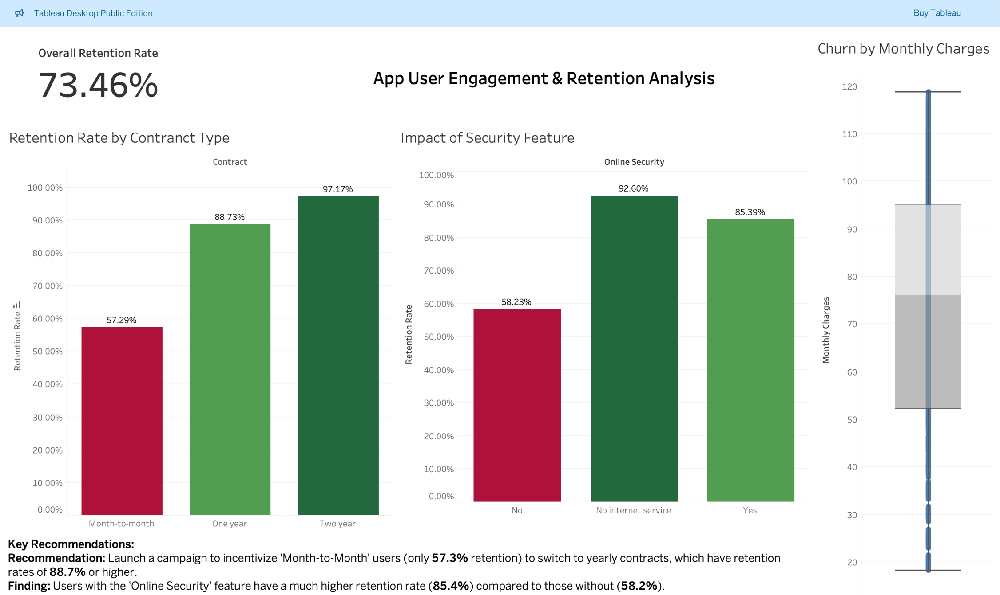

# Telecom_customer_churn-EDA

### A comprehensive analysis of user data to identify key drivers of customer retention, culminating in an interactive Tableau dashboard.

---

## 📊 Interactive Dashboard

This project's final output is an interactive dashboard built in Tableau. It allows for dynamic exploration of the factors affecting user retention.

---

## 🎯 Project Goal

The primary goal of this project was to analyze a dataset of app user activity to understand the patterns of engagement and retention. The key objective was to identify specific user behaviors or characteristics that are highly correlated with a user's decision to stay with the service, and to present these findings in a clear, actionable format for business stakeholders.

### Key Questions:
* What is the overall retention rate?
* Which user segments are most at risk of churning?
* Do specific features or services (like Online Security) impact user retention?
* How does the user's contract type or monthly charges relate to their likelihood of churning?

---

## 🛠️ Technologies & Libraries Used

* **Python:** For data cleaning, analysis, and preparation.
* **Pandas:** For data manipulation and aggregation.
* **Matplotlib & Seaborn:** For static data visualization during the exploratory phase.
* **Jupyter Notebook:** As the environment for analysis.
* **Tableau:** For creating the final interactive dashboard.

---

## ⚙️ Project Workflow

1.  **Data Cleaning & Preparation:** The raw data from the Telco Customer Churn dataset was loaded into a Pandas DataFrame. I handled missing values, corrected data types, and engineered a new `retained` column for easier analysis.
2.  **Exploratory Data Analysis (EDA):** I performed a deep dive into the data using Python to uncover initial trends, test hypotheses, and identify significant correlations between user attributes and retention rates.
3.  **Dashboarding & Visualization:** The cleaned data was exported to a CSV file and connected to Tableau. I built a series of charts to visualize the key findings and assembled them into a single, interactive dashboard designed for business users.

---

## 📈 Key Insights & Recommendations

My analysis uncovered several key drivers of user retention, leading to the following actionable recommendations:

* **Finding 1: Contract Type is a Major Factor.**
    * Users on `Month-to-Month` contracts have a significantly lower retention rate (**57.3%**) compared to those on `One Year` (**88.7%**) or `Two Year` (**97.1%**) contracts.
    * **Recommendation:** Launch a targeted marketing campaign to incentivize Month-to-Month users to upgrade to longer-term contracts, perhaps by offering a discount.

* **Finding 2: Key Features Drive Loyalty.**
    * Users who subscribe to the `Online Security` feature have a much higher retention rate (**85.4%**) than those who do not (**58.2%**).
    * **Recommendation:** Promote the Online Security feature during the user onboarding process or offer a free trial to demonstrate its value, as it is a strong indicator of a long-term user.
